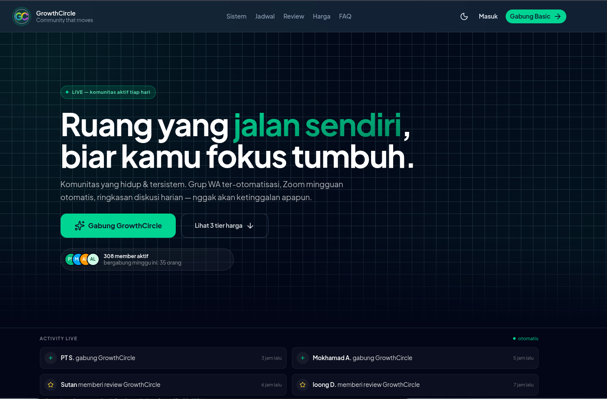

# gc-provider

OpenClaw model-provider plugin for GrowthCircle.id.

<p>
  
</p>

It registers `GrowthCircle.id` as provider `growthcircle` and uses the OpenAI-compatible endpoint:

```text
https://ai.growthcircle.id/v1
```

Model discovery is auth-aware. The plugin calls `/models` with the configured API key, so `gc-free`, `gc-paid`, and `gc-team` keys can expose different model catalogs without separate provider ids.

## Install

Install OpenClaw first, then install this plugin before model configuration:

```sh
npm install -g openclaw
openclaw plugins install gc-provider --pin
openclaw plugins enable gc-provider
```

Configure GrowthCircle.id auth:

```sh
openclaw onboard --auth-choice growthcircle-api-key --growthcircle-api-key "$GROWTHCIRCLE_API_KEY"
```

Or set the key in your shell and use the interactive model section:

```sh
export GROWTHCIRCLE_API_KEY="gc-..."
openclaw configure --section=model
```

Then choose a model from the key-specific catalog:

```sh
openclaw models list --provider growthcircle
openclaw models set growthcircle/<model-id>
openclaw gateway restart
```

The onboarding default is `growthcircle/gpt-5.5`, with OpenClaw's current
GPT-5.5 metadata (`contextWindow: 272000`, `maxTokens: 128000`) and
`agents.defaults.thinkingDefault: "medium"` when no thinking default already
exists.

## Local Development Install

From this repository:

```sh
npm install
npm test
npm run typecheck
openclaw plugins install -l .
openclaw plugins enable gc-provider
openclaw plugins inspect gc-provider
```

## Provider Details

- Plugin id: `gc-provider`
- Provider id: `growthcircle`
- Display name: `GrowthCircle.id`
- API mode: `openai-completions`
- Base URL: `https://ai.growthcircle.id/v1`
- API key env var: `GROWTHCIRCLE_API_KEY`
- Model reference format: `growthcircle/<model-id>`
- Default model: `growthcircle/gpt-5.5`
- Default thinking level: `medium`

Do not commit API keys. Rotate any key used for public demos or shared testing.
